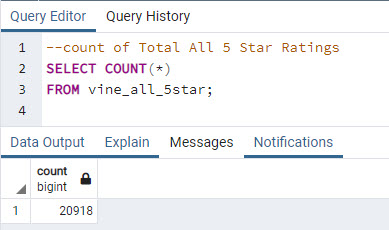
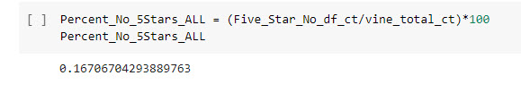

# Amazon_Vine_Analysis

## Project Overview

As the first data expert at BigMarket, a startup company that helps businesses optimize their marketing efforts. One of their clients, $ellby, is going to release a large catalog of products on a leading retail website. $ellby wants to understand how the reviews of their products compare to the reviews of their competitors' products. 

In this study, an analysis was done of Amazon reviews comparing the reviews of Amazon Vine program subscribers to reviews from nonsubscribers. The goal was to determine if more favorable reviews came from paid Vine subscriptions versus reviews that were not a part of a paid Vine subscription. 

The Amazon data that was analyzed was for digital Ebook purchases:

https://s3.amazonaws.com/amazon-reviews-pds/tsv/amazon_reviews_us_Digital_Ebook_Purchase_v1_01.tsv.gz

---

## Tools Used

- Spark
- PySpark
- Google Colabs
- AWS S3 and RDS
- postgreSQL

---

## Results

- Total Number of Reviews Greater than 20: **70,726**
- Number of Helpful Votes Divided by the Total Votes Is Equal to or Greater than 50%: **54,092**
- Data Where Review was Part of the Vine Program or a NonSubscriber
	- Vine Subscriber: **0**
	- Non-Vine Subscriber: **54,092**
- Total 5-Star Reviews: **20,918**
- Number of 5-Star Vine Reviews: **0**
- Number of Non-Vine Reviews: **20,918**
- Total Number of Reviews: **12,520,722**
- Percentage of Vine vs. Non-Vine Reviews to 5-Star Reviews
	- Vine Review Percentage: **0%**
	- Non-Vine Review Percentage: **100%**
- Percentage of Vine vs. Non-Vine Reviews to Total of All Unfiltered Reviews
	- Vine Review Percentage: **0%**
	- Non-Vine Review Percentage: **.17%**

The data was analyzed in both SQL and PySpark to demonstrate two different ways to analyze the data.

## SQL and Pyspark Code

### Total Number of Reviews Greater than 20

The vine_df table was filtered to create a new DataFrame/table to retrieve all the rows where the total_votes count is equal to or greater than 20 to pick reviews that are more likely to be helpful. Fewer reviews might not add any useful data to the analysis.

**PySpark**

**SQL**

 

### Number of Helpful Votes Divided by the Total Votes Is Equal to or Greater than 50%

The total_votes DataFrame and table were filtered to retrieve all the rows where the number of helpful votes divided by the total number of votes was >= 50%. This step aids in the analysis because the more helpful votes are included in the analysis.

**PySpark**

**SQL**

 

 

### Data Where Review was Part of the Vine Program or a NonSubscriber

In this step, the PySpark DataFrame and SQL table from the former step were filtered to retrieve all the rows where a review was written as part of the Vine program and a new PySpark DataFrame and SQL table were created. The steps were repeated to create a new table for reviews that were not part of the Vine program.

#### Vine Subscriptions

**PySpark**

**SQL**

 

 

#### Non-Vine Subscriptions

**PySpark**

**SQL**

 

 

### Total 5-Star Reviews, Number of Vine Reviews and Non-Vine Reviews

The data was analyzed to determine the total number of reviews. Then the previous DataFrame/Table were filtered to create a new DataFrame/Table for 5-star reviews for both subscribers to the Vine program and non-subscribers. The percentage of Vine and Non-Vine 5-star reviews were then calculated.

**PySpark Total Count of 5-Star Reviews**

**SQL Total Count of 5-Star Reviews**

**PySpark 5-Star Vine Reviews**

**SQL 5-Star Vine Reviews**

**PySpark 5-Star Non-Vine Reviews**

**SQL 5-Star Non-Vine Reviews**

### Total Number of Reviews

**PySpark**

**SQL**

### Percentage of Vine vs. Non-Vine Reviews to Filtered 5-Star Reviews

**PySpark 5-Star Percentage of Non-Vine Reviews**

**PySpark 5-Star Percentage of Vine Reviews**

**SQL 5-Star Percentage of Vine and Non-Vine Reviews**

### Percentage of Vine vs. Non-Vine Reviews Compared to Total of All Unfiltered Reviews

**PySpark 5-Star Percentage of Non-Vine Reviews Compared to Total of All Unfiltered Reviews**

**PySpark 5-Star Percentage of Vine Reviews Compared to Total of All Unfiltered Reviews**

**SQL 5-Star Percentage of Vine and Non-Vine Reviews Compared to Total of All Unfiltered Reviews**

---

## Summary

This study's purpose was to analyze whether the reviews of Amazon Vine program subscribers had any positive bias compared to reviews from nonsubscribers. If there was bias, more favorable reviews would come from paid Vine subscriptions versus nonsubscriber reviews.

The data for this study shows the exact opposite. There was definite bias for **nonsubcriber** reviews. In fact, there were no 5-star Vine reviews in the filtered data. Every 5-star review in this dataset came from a nonsubscriber.

Another analysis shows how few Vine subscribers there are in the total unfiltered dataset. Out of 12,520,722 reviews, there are only **32** vine reviews. When the data is filtered, none of these 32 Vine reviews are inlcuded in the filtered results.

The percentage of all Vine subscribers (0.00026%) out of the total number of reviews in this dataset are shown below.

